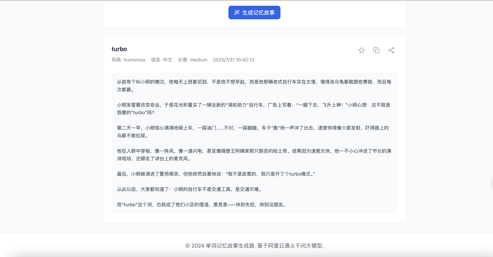

# 📚 单词记忆故事生成器

一个基于React和阿里云大模型的纯前端应用，帮助用户通过生成有趣的故事来记忆单词、短语和句子。

## 🎯 项目展示

### 🎉 第一个里程碑成果 (2025/7/31)

**成功为单词"turbo"生成幽默风格的中文故事**



**生成效果**:
- ✅ 故事内容有趣且符合幽默风格
- ✅ 成功融入了目标词汇"turbo"
- ✅ 故事结构完整，有开头、发展、结尾
- ✅ 语言表达自然，符合中文表达习惯
- ✅ 长度适中，便于记忆

---

## 🎉 项目里程碑

### ✅ 第一个里程碑 - 成功实现故事生成功能 (2025/7/31)

**重要成就：**
- 🚀 **首次成功生成故事**：成功为单词"turbo"生成了幽默风格的中文故事
- 🔧 **API集成完成**：成功集成阿里云通义千问兼容模式API
- 🛠️ **代理配置优化**：解决了CORS跨域问题，实现了稳定的API调用
- 📱 **用户体验验证**：验证了完整的故事生成流程，从输入到输出的全链路功能

**技术突破：**
- 解决了API令牌认证失败问题
- 实现了通义千问兼容模式的正确配置
- 优化了代理服务器配置，支持多种API端点
- 完善了错误处理和用户反馈机制

**生成效果示例：**
```
标题: turbo
风格: humorous | 语言: 中文 | 长度: medium
时间: 2025/7/31 10:42:12

故事内容: 小明是个懒人，总是迟到。他买了一辆"turbo辅助"自行车，
结果骑得太快撞进了市长演讲现场，还抢了话筒...
最终"turbo"成了当地俚语，意思是"快得失控，酷得吓跑朋友"。
```

**下一步计划：**
- 优化故事生成质量
- 增加更多故事风格和模板
- 实现故事分享功能
- 添加用户反馈机制

**项目截图**:


---

## ✨ 功能特性

- 🎯 **智能故事生成**：基于阿里云通义千问大模型，为输入的词汇生成有趣的记忆故事
- 🎨 **多种故事风格**：支持幽默、奇幻、冒险、教育、悬疑、浪漫等多种风格
- 🌍 **双语支持**：支持中文和英文故事生成
- 📏 **长度可调**：可选择简短、中等、详细三种故事长度
- ⭐ **收藏功能**：收藏喜欢的故事，方便复习
- 📚 **历史记录**：自动保存生成历史，随时回顾
- 🎨 **主题切换**：支持浅色和深色主题
- 📱 **响应式设计**：完美适配桌面端和移动端
- 🔒 **本地存储**：数据安全存储在本地，保护隐私

## 🚀 快速开始

### 环境要求

- Node.js >= 20.19.0
- npm >= 8.0.0

### 安装依赖

```bash
cnpm install
```

### 启动开发服务器

```bash
npm run dev
```

### 构建生产版本

```bash
npm run build
```

### 预览生产版本

```bash
npm run preview
```

## 🔧 配置说明

### 阿里云API配置

1. 登录[阿里云控制台](https://console.aliyun.com/)
2. 进入"通义千问"服务
3. 创建API密钥
4. 在应用中点击右上角的设置按钮
5. 输入API密钥和端点地址
6. 点击"测试连接"验证配置
7. 保存配置

### 支持的模型

- **qwen-turbo**：快速响应，适合对话
- **qwen-plus**：平衡性能和效果
- **qwen-max**：最高质量，适合复杂任务

## 📖 使用指南

### 生成故事

1. 在输入框中输入要记忆的单词、短语或句子
2. 选择故事风格（幽默、奇幻、冒险等）
3. 选择语言（中文或英文）
4. 选择故事长度
5. 点击"生成记忆故事"按钮

### 管理故事

- **收藏故事**：点击故事卡片上的星标按钮
- **查看历史**：在历史记录区域查看之前生成的故事
- **复制故事**：点击复制按钮将故事内容复制到剪贴板
- **分享故事**：点击分享按钮分享故事

## 🛠️ 技术栈

- **前端框架**：React 18 + TypeScript
- **构建工具**：Vite
- **状态管理**：Zustand
- **UI组件库**：Ant Design
- **样式方案**：Tailwind CSS
- **HTTP客户端**：Axios
- **路由管理**：React Router DOM
- **图标库**：Lucide React
- **代码规范**：ESLint + Prettier

## 📋 项目文档

- **[需求文档](REQUIREMENTS.md)** - 详细的功能需求和技术要求
- **[环境配置](env.example)** - API配置示例

## 📁 项目结构

```
word-story-generator/
├── src/
│   ├── components/          # React组件
│   │   ├── InputForm.tsx    # 输入表单组件
│   │   ├── StoryDisplay.tsx # 故事展示组件
│   │   ├── ApiConfig.tsx    # API配置组件
│   │   ├── StoryCard.tsx    # 故事卡片组件
│   │   ├── Header.tsx       # 头部组件
│   │   └── Footer.tsx       # 底部组件
│   ├── hooks/               # 自定义Hooks
│   │   ├── useStory.ts      # 故事相关Hook
│   │   ├── useApi.ts        # API相关Hook
│   │   └── useStorage.ts    # 存储相关Hook
│   ├── services/            # 服务层
│   │   ├── aliyunApi.ts     # 阿里云API服务
│   │   └── storageService.ts # 本地存储服务
│   ├── stores/              # 状态管理
│   │   └── storyStore.ts    # 故事状态管理
│   ├── types/               # TypeScript类型定义
│   │   └── index.ts
│   ├── utils/               # 工具函数
│   │   ├── constants.ts     # 常量定义
│   │   └── helpers.ts       # 辅助函数
│   ├── styles/              # 样式文件
│   │   └── index.css        # 全局样式
│   ├── App.tsx              # 主应用组件
│   └── main.tsx             # 应用入口
├── public/                  # 静态资源
├── package.json             # 项目配置
├── vite.config.ts           # Vite配置
├── tsconfig.json            # TypeScript配置
├── tailwind.config.js       # Tailwind配置
├── .eslintrc.js            # ESLint配置
├── .prettierrc             # Prettier配置
└── README.md               # 项目说明
```

## 🔒 隐私说明

- 所有数据都存储在本地浏览器中
- API密钥仅用于与阿里云服务通信
- 不会收集或上传用户的个人信息
- 建议定期清理浏览器数据以保护隐私

## 🤝 贡献指南

欢迎提交Issue和Pull Request来改进这个项目！

### 开发流程

1. Fork 项目
2. 创建功能分支 (`git checkout -b feature/AmazingFeature`)
3. 提交更改 (`git commit -m 'Add some AmazingFeature'`)
4. 推送到分支 (`git push origin feature/AmazingFeature`)
5. 打开 Pull Request

## 📄 许可证

本项目采用 MIT 许可证 - 查看 [LICENSE](LICENSE) 文件了解详情。

## 🙏 致谢

- **阿里云通义千问**：提供强大的大语言模型支持，使故事生成功能成为可能
- **React生态**：优秀的开源框架和工具链
- **开源社区**：所有为这个项目提供灵感和帮助的开源项目

## 📞 联系方式

如有问题或建议，请通过以下方式联系：

- 提交 [Issue](https://github.com/your-username/word-story-generator/issues)
⭐ 如果这个项目对你有帮助，请给它一个星标！
